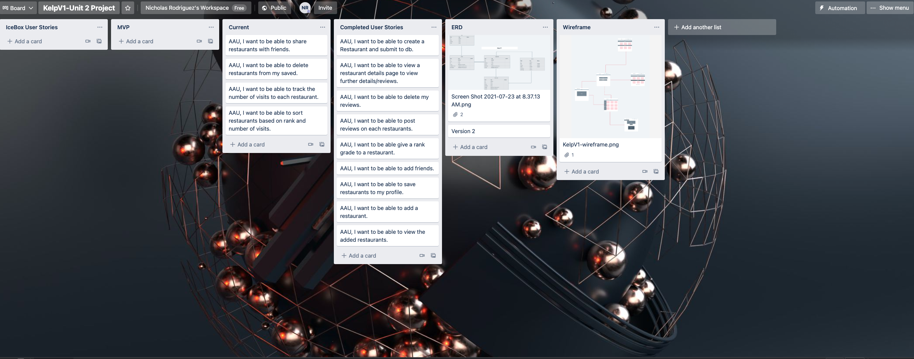
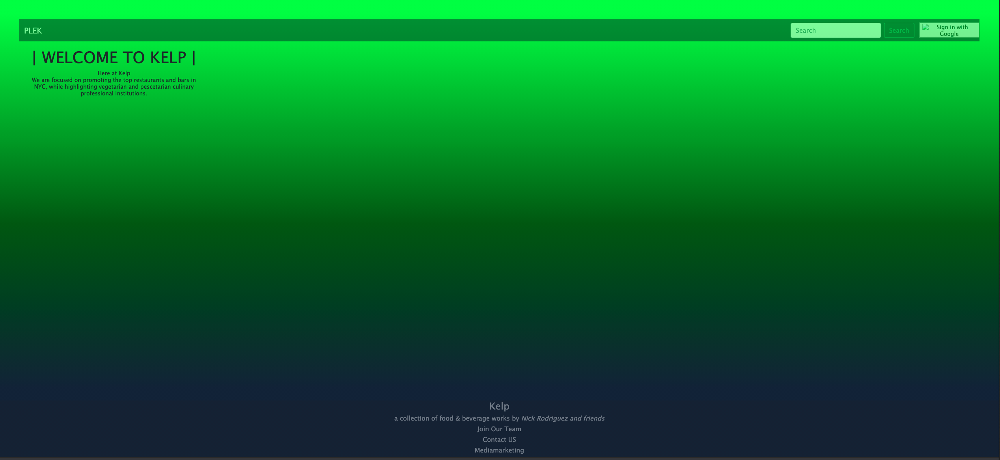
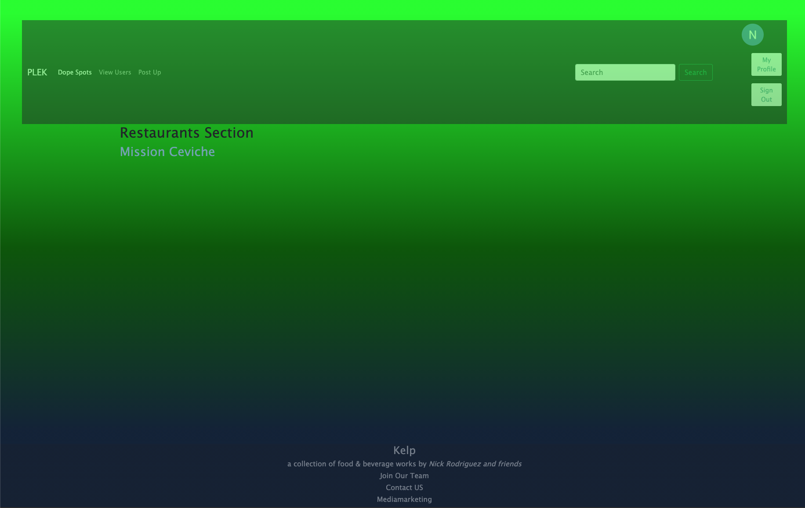

# Kelp by kelp 
# #Kelp is an app where a users will be able to add restaurants (mainly vegetarian and pescatarian) and share them with other users. Users will be able to interact with each other through these restaurant posts. My inspiration came from my love/ background of food... and the industry I guess. 

# Bio 
## Getting started 
- First log in with your google account. 
- Go to Post up and enter a restaurant name, a short description and a rating. Restaurant has been created in Dope Spots 
- Go to Dope spots 
- 

#
#Getting Started: 
#link to site : https://glacial-plains-71834.herokuapp.com/

#ERD

#TRELLO 

#Landing Page 

#Restaurant Page 

# Technologies

HTML 
CSS
JS
Node.js
EJS
BOOTSTRAP
Google OAuth 2.0
Bootstrap

# Future Enhancements 
1) Add an api.
 
