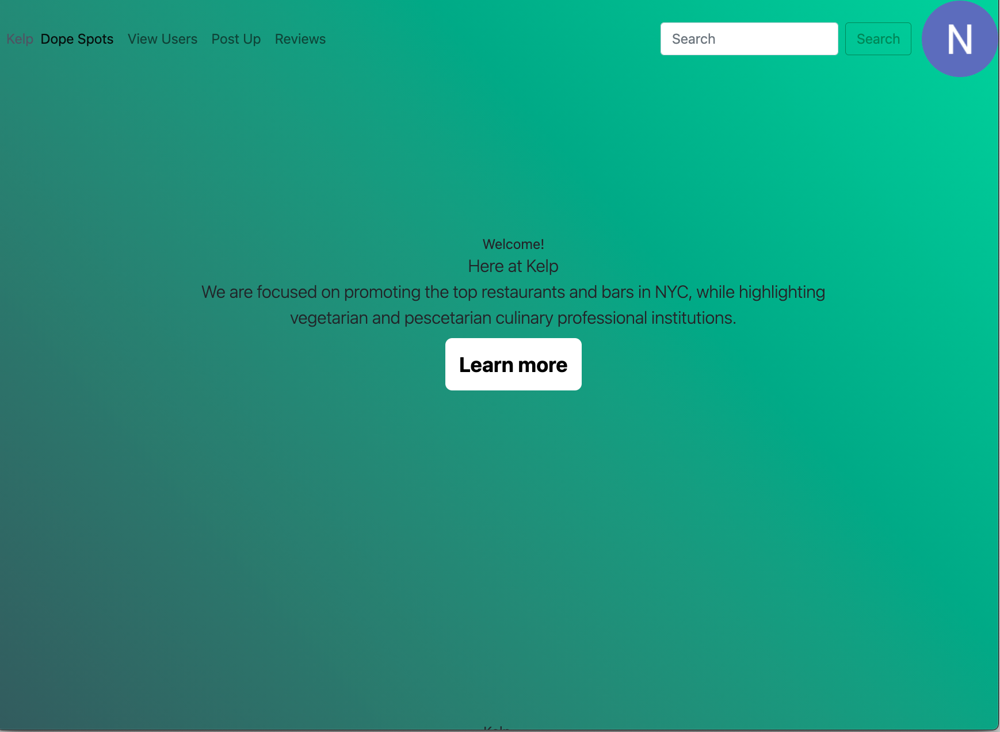
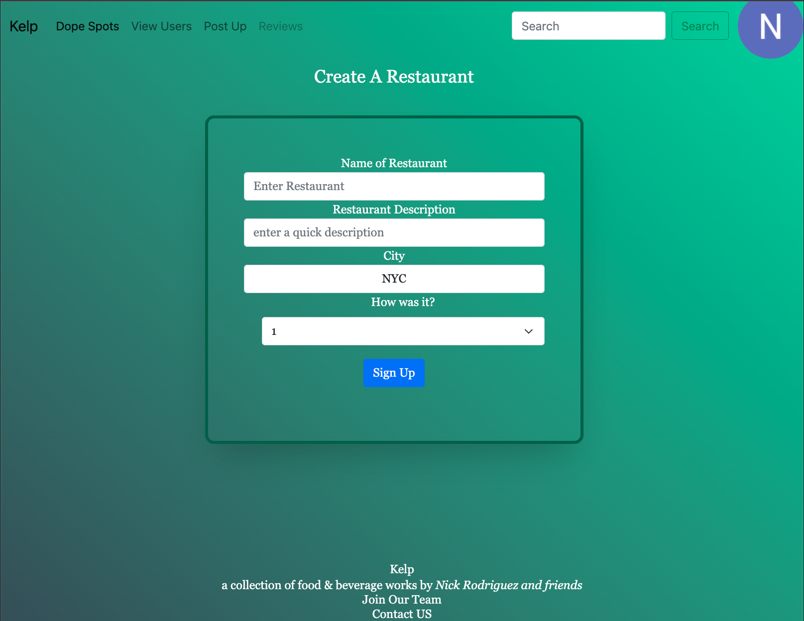

# KELP
## Introduction
Kelp is an app where a users will be able to add restaurants and share them with other users. Users will be able to interact with each other through these restaurant posts. My inspiration came from my love/ background of food... and the industry I guess. 

# Bio 
## Getting started 
- First log in with your google account. 
- Go to Post up and enter a restaurant name, a short description and a rating. Restaurant has been created in Dope Spots 
- Go to Dope spots 
- select a restaurant and you will be redirected to the restauarnt show page 
- Users will be able to leave reviews reply to them and delete reviews 

#
## Getting Started: 
#link to site : https://glacial-plains-71834.herokuapp.com/

## Tech Framework
### This app uses:

* [Node.js](https://nodejs.org/en/) v 14.17.1 & [Express](https://expressjs.com/) v 4.17.1
* [MongoDB](https://www.mongodb.com/cloud/atlas)
* [TailwindCSS](https://tailwindcss.com/)
* [dot env](https://www.npmjs.com/package/dotenv)
* [Mongoose](https://www.npmjs.com/package/mongoose)
* CSS
* Javascript

## This app is hosted at: 
* [GitHub Repo](https://github.com/nrayrod1016/kelp-v1)
* [Hosted Site](https://nrayrod1016.github.io/kelp-v1/)

## About the Developer
### Nick Rodriguez

Nick is a full stack web developer from the NYC area, with a passion for food, culture and technology. Nick decided to get into software development after after a 5 years in the Hospitality Management Industry. Learn more about Nick at these links:

* [LinkedIn](https://www.linkedin.com/in/nicholas-r-rodriguez/)
* [GitHub](https://github.com/nrayrod1016)

## Screenshots

[Back to Top](#top)

 
